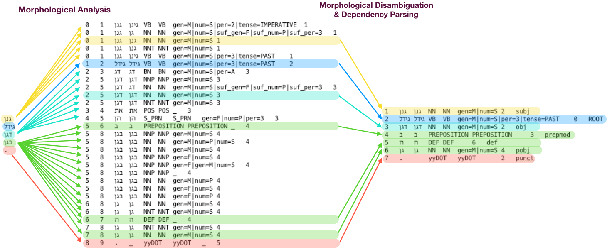

# <center>YAP - Yet Another (natural language) Parser<br>The building block for Hebrew NLP</center>



YAP was implemented to test the hypothesis on Joint Morpho-Syntactic Processing of Morphologically Rich Languages (MRLs) in a Transition Based Framework.
The parser was written as part Amir More's MSc thesis at IDC Herzliya under the supervision of Dr. Reut Tsarfaty from the Open University of Israel.
The models and training regimes have been tuned and improved by Amit Seker from the Open University.

A live demo of parsing Hebrew texts is provided [here](http://nlp.biu.ac.il/~rtsarfaty/onlp/hebrew/).

YAP is currently supported as part of the ONLP lab tool kit.

  * [How it Works](#how-it-works)
    + [Input](#input)
    + [Output](#output)
  * [Quick Start](#quick-start)
    + [Requirements](#requirements)
    + [Compilation](#compilation)
    + [Running from the command line](#running-from-the-command-line)
      - [Input File](#input-file)
      - [Running YAP in 2 steps](#running-yap-in-2-steps)
      - [Output Files](#output-files)
    + [Running YAP as a restful service](#running-yap-as-a-restful-service)
  * [Joint vs Pipeline](#joint-vs-pipeline)
  * [FAQ](#faq)
    + [1. Lattice file format](#1-lattice-file-format)
    + [2. CoNLL file format](#2-conll-file-format)
    + [3. Morphological and dependency schemes](#3-morphological-and-dependency-schemes)
    + [4. Tokenization](#4-tokenization)
    + [5. Domain specific customization](#5-domain-specific-customization)
  * [Publications](#publications)
  * [Licensing Highlights](#licensing-highlights)
  * [Reference](#reference)
  * [Citation](#citation)
  * [License](#license)

## How it Works

In MRLs, each token may have multiple different morphological analyses,
where only one is relevant in context. This morphological ambiguity is represented by a
word-lattice describing the various morpheme sequences that may combine to form it, with only
one sequence suited in the context of the sentence. 

Morphological Disambiguation (MD) is particularly difficult in MRLs due significant morphological richness.

YAP provides a framework currently supporting Modern Hebrew that does lexicon-based morphological analysis
followed by a joint morph-syntactic disambiguation and dependency parsing.

### Input

YAP works on the tokenized sentence level,
meaning that the input to YAP is a list of tokens:

```console
גנן
גידל
דגן
בגן
.
```
    
### Output

Morphological Analysis Lattice:

```console
0	1	גנן	גינן	VB	VB	gen=M|num=S|per=2|tense=IMPERATIVE	1
0	1	גנן	גן	NN	NN	gen=M|num=S|suf_gen=F|suf_num=P|suf_per=3	1
0	1	גנן	גנן	NN	NN	gen=M|num=S	1
0	1	גנן	גנן	NNT	NNT	gen=M|num=S	1
0	1	גנן	גינן	VB	VB	gen=M|num=S|per=3|tense=PAST	1
1	2	גידל	גידל	VB	VB	gen=M|num=S|per=3|tense=PAST	2
2	3	דג	דג	BN	BN	gen=M|num=S|per=A	3
2	5	דגן	דגן	NNP	NNP	gen=M|num=S	3
2	5	דגן	דג	NN	NN	gen=M|num=S|suf_gen=F|suf_num=P|suf_per=3	3
2	5	דגן	דגן	NN	NN	gen=M|num=S	3
2	5	דגן	דגן	NNT	NNT	gen=M|num=S	3
3	4	את	את	POS	POS	_	3
4	5	הן	הן	S_PRN	S_PRN	gen=F|num=P|per=3	3
5	6	ב	ב	PREPOSITION	PREPOSITION	_	4
5	8	בגן	בגן	NNP	NNP	gen=M|num=S	4
5	8	בגן	בגן	NN	NN	gen=M|num=P|num=S	4
5	8	בגן	בגן	NN	NN	gen=M|num=S	4
5	8	בגן	בגן	NNP	NNP	gen=F|num=S	4
5	8	בגן	בגן	NNP	NNP	gen=F|gen=M|num=S	4
5	8	בגן	בגן	NNP	NNP	_	4
5	8	בגן	בגן	NN	NN	gen=M|num=P	4
5	8	בגן	בגן	NN	NN	gen=F|num=S	4
5	8	בגן	בגן	NN	NN	gen=F|num=P	4
6	8	גן	גן	NN	NN	gen=M|num=S	4
6	8	גן	גן	NNT	NNT	gen=M|num=S	4
6	7	ה	ה	DEF	DEF	_	4
7	8	גן	גן	NNT	NNT	gen=M|num=S	4
7	8	גן	גן	NN	NN	gen=M|num=S	4
8	9	.	_	yyDOT	yyDOT	_	5
```

Morphological Disambiguation Lattice:

```console
0	1	גנן	גנן	NN	NN	gen=M|num=S	1
1	2	גידל	גידל	VB	VB	gen=M|num=S|per=3|tense=PAST	2
2	3	דגן	דגן	NN	NN	gen=M|num=S	3
3	4	ב	ב	PREPOSITION	PREPOSITION	_	4
4	5	ה	ה	DEF	DEF	_	4
5	6	גן	גן	NN	NN	gen=M|num=S	4
6	7	.	_	yyDOT	yyDOT	_	5
```

Dependency Parse Tree:

```console
1	גנן	גנן	NN	NN	gen=M|num=S	2	subj	_	_
2	גידל	גידל	VB	VB	gen=M|num=S|per=3|tense=PAST	0	ROOT	_	_
3	דגן	דגן	NN	NN	gen=M|num=S	2	obj	_	_
4	ב	ב	PREPOSITION	PREPOSITION		3	prepmod	_	_
5	ה	ה	DEF	DEF		6	def	_	_
6	גן	גן	NN	NN	gen=M|num=S	4	pobj	_	_
7	.		yyDOT	yyDOT		2	punct	_	_
```

**MA and MD:**
The node indices in the MA and MD outputs do not match. This means that while the MA output represents an ambiguous lattice
with several possible paths through the graph, the MD output represents a single path and you'll notice that the node indices
are sequential and do not map to the original MA lattice.

**Lattice and CoNLL:**
Each line in the MD (or MA) output lattice file represents an edge in the lattice and the last column specifies the original token id.
Each line the dependency CoNLL output file represents a node in the parse tree. The MD lattice and Dep CoNLL output files
are aligned, meaning that in order to get back the token id of a dependency node you can look up the last column of 
the corresponding line in the lattice file.

## Quick Start

YAP has been tested and verified to run on Windows, Linux and MacOS.

**Windows users:** YAP doesn't handle Windows style text files that have [BOM](https://en.wikipedia.org/wiki/Byte_order_mark) marks and [CRLF](https://en.wikipedia.org/wiki/Newline) newlines.
So if you're running on Windows and YAP doesn't work make sure you don't have CRLF line endings and no BOM mark.

### Requirements

- [Go](http://www.golang.org)
- [Git](https://git-scm.com/downloads)
- bzip2
- 6GB RAM

### Compilation

The following instructions are for Linux but similarly this can be done on Windows and MacOS.

- Make sure you have Go and Git installed and on the command PATH.
- Setup a Go environment:
  - Create a directory (usually per workspace/project) ``mkdir yapproj; cd yapproj``
  - Set ``$GOPATH`` environment variable to your workspace: ``export GOPATH=path/to/yapproj``
  - In the workspace directory create the src subdirectory: ``mkdir src``
  - cd into the src directory ``cd src``
- Clone the repository in the src folder of the workspace ``git clone https://github.com/OnlpLab/yap.git``
- Unzip the models and build the application:

```console
$ cd yap
$ bunzip2 data/*.bz2
$ go get .
$ go build .
$ ./yap
./yap - invoke yap as a standalone app or as an api server

Commands:

    api         start api server
    dep         runs dependency training/parsing
    hebma       run lexicon-based morphological analyzer on raw input
    joint       runs joint morpho-syntactic training and parsing
    ma          run data-driven morphological analyzer on raw input
    malearn     generate a data-driven morphological analysis dictionary for a set of files
    md          runs standalone morphological disambiguation training and parsing

Use "./yap help <command>" for more information about a command
```

### Running YAP from the command line

From the command line you can process one input file at a time. It is possible to have multiple sentences in a single file.

#### Input File

One token per line (including punctuation), empty line separating sentences.

THE LAST LINE IN THE FILE MUST BE EMPTY:

```console
$ cat input.txt
גנן
גידל
דגן
בגן
.

$
```

#### Processing a file

1. Morphological Analysis - given the input tokens, generate the ambiguous lattices:

    ```console
    $ ./yap hebma -raw input.txt -out input.lattice
    ```

2. Morphological Disambiguation and Dependency Parsing - given the input ambiguous lattices, disambiguate and parse:

    ```console
    $ ./yap joint -in input.lattice -os output.segmentation -om output.mapping -oc output.conll
    ```

### Running YAP as a RESTful API server

1. YAP can run as a server listening on port 8000:

    ```console
    $ ./yap api
    ```

2. You can then send HTTP GET requests with json objects in the request body and receive back a json object containing the 3 output levels:

    ```console
    $ curl -s -X GET -H 'Content-Type: application/json' -d'{"text": "גנן גידל דגן בגן  "}' localhost:8000/yap/heb/joint | jq .
    {
      "ma_lattice": "0\t1\tגנן\tגינן\tVB\tVB\tgen=M|num=S|per=2|tense=IMPERATIVE\t1\n0\t1\tגנן\tגן\tNN\tNN\tgen=M|num=S|suf_gen=F|suf_num=P|suf_per=3\t1\n0\t1\tגנן\tגנן\tNN\tNN\tgen=M|num=S\t1\n0\t1\tגנן\tגנן\tNNT\tNNT\tgen=M|num=S\t1\n0\t1\tגנן\tגינן\tVB\tVB\tgen=M|num=S|per=3|tense=PAST\t1\n1\t2\tגידל\tגידל\tVB\tVB\tgen=M|num=S|per=3|tense=PAST\t2\n2\t3\tדג\tדג\tBN\tBN\tgen=M|num=S|per=A\t3\n2\t5\tדגן\tדגן\tNNP\tNNP\tgen=M|num=S\t3\n2\t5\tדגן\tדג\tNN\tNN\tgen=M|num=S|suf_gen=F|suf_num=P|suf_per=3\t3\n2\t5\tדגן\tדגן\tNN\tNN\tgen=M|num=S\t3\n2\t5\tדגן\tדגן\tNNT\tNNT\tgen=M|num=S\t3\n3\t4\tאת\tאת\tPOS\tPOS\t_\t3\n4\t5\tהן\tהן\tS_PRN\tS_PRN\tgen=F|num=P|per=3\t3\n5\t6\tב\tב\tPREPOSITION\tPREPOSITION\t_\t4\n5\t8\tבגן\tבגן\tNNP\tNNP\tgen=M|num=S\t4\n5\t8\tבגן\tבגן\tNN\tNN\tgen=M|num=P|num=S\t4\n5\t8\tבגן\tבגן\tNN\tNN\tgen=M|num=S\t4\n5\t8\tבגן\tבגן\tNNP\tNNP\tgen=F|num=S\t4\n5\t8\tבגן\tבגן\tNNP\tNNP\tgen=F|gen=M|num=S\t4\n5\t8\tבגן\tבגן\tNNP\tNNP\t_\t4\n5\t8\tבגן\tבגן\tNN\tNN\tgen=M|num=P\t4\n5\t8\tבגן\tבגן\tNN\tNN\tgen=F|num=S\t4\n5\t8\tבגן\tבגן\tNN\tNN\tgen=F|num=P\t4\n6\t8\tגן\tגן\tNN\tNN\tgen=M|num=S\t4\n6\t8\tגן\tגן\tNNT\tNNT\tgen=M|num=S\t4\n6\t7\tה\tה\tDEF\tDEF\t_\t4\n7\t8\tגן\tגן\tNNT\tNNT\tgen=M|num=S\t4\n7\t8\tגן\tגן\tNN\tNN\tgen=M|num=S\t4\n\n",
      "md_lattice": "0\t1\tגנן\tגנן\tNN\tNN\tgen=M|num=S\t1\n1\t2\tגידל\tגידל\tVB\tVB\tgen=M|num=S|per=3|tense=PAST\t2\n2\t3\tדגן\tדגן\tNN\tNN\tgen=M|num=S\t3\n3\t4\tב\tב\tPREPOSITION\tPREPOSITION\t_\t4\n4\t5\tה\tה\tDEF\tDEF\t_\t4\n5\t6\tגן\tגן\tNN\tNN\tgen=M|num=S\t4\n\n",
      "dep_tree": "1\tגנן\tגנן\tNN\tNN\tgen=M|num=S\t2\tsubj\t_\t_\n2\tגידל\tגידל\tVB\tVB\tgen=M|num=S|per=3|tense=PAST\t0\tROOT\t_\t_\n3\tדגן\tדגן\tNN\tNN\tgen=M|num=S\t2\tobj\t_\t_\n4\tב\tב\tPREPOSITION\tPREPOSITION\t\t2\tprepmod\t_\t_\n5\tה\tה\tDEF\tDEF\t\t6\tdef\t_\t_\n6\tגן\tגן\tNN\tNN\tgen=M|num=S\t4\tpobj\t_\t_\n\n"
    }
    ```

    Or if you want you can clean the escape characters and get the output in the same format as the command line output files:

    ```console
    $ curl -s -X GET -H 'Content-Type: application/json' -d'{"text": "גנן גידל דגן בגן  "}' localhost:8000/yap/heb/joint | jq '.ma_lattice, .md_lattice, .dep_tree' | sed -e 's/^.//' -e 's/.$//' -e 's/\\t/\t/g' -e 's/\\n/\n/g'

## Joint vs Pipeline

The joint morph-syntactic framework has been shown to improve both morphological disambiguation as well as dependenyc parsing accuracy compared to a pipeline architecture where morphological disambiguation runs independently and then dependency parsing runs given the disambiguated lattice.

While the joint framework should be used in general, it is possible to run YAP in a pipeline fashion, in which case processing is done in 3 steps:

1. Morphological Analysis - same as for the joint processing flow:

    ```console
    $ ./yap hebma -raw input.txt -out input.lattice
    ```

2. Morphological Disambiguation - given the input ambiguous lattices, output the disambiguated lattice:

    ```console
    $ ./yap md -in input.lattice -om output.mapping
    ```

3. Dependency Parsing - given the disambiguated lattice, output the dependency tree:

    ```console
    $ ./yap dep -inl output.mapping -oc output.conll
    ```

## FAQ

### 1. Lattice file format

A lattice file is a graph representation where every path in the graph is a possible sequence of morphemes.
Each line in the lattice file is an edge in the graph:

- FROM: Index of the outgoing vertex of the edge
- TO: Index of the incoming vertex of the edge
- FORM: word form or punctuation mark
- LEMMA: Lemma of the word form; underscore if not available
- CPOSTAG: Coarse-grained part-of-speech tag; underscore if not available
- POSTAG: Fine-grained part-of-speech tag; underscore if not available; in YAP both POSTAG and CPOSTAG are always identical
- FEATS: List of morphological features separated by a vertical bar (|) from a pre-defined language-specific inventory; underscore if not available
- TOKEN: Source token index

### 2. CoNLL file format

The CoNLL format is used to represent dependency trees.
Each line represents a node in the tree:

- ID: Morpheme index, starting at 1 for each new sentence
- FORM: Word form or punctuation mark
- LEMMA: Lemma of word form; underscore if not available
- CPOSTAG: Coarse-grained part-of-speech tag; underscore if not available
- POSTAG: Fine-grained part-of-speech tag; underscore if not available; in YAP both POSTAG and CPOSTAG are always identical
- FEATS: List of morphological features separated by a vertical bar (|) from a pre-defined language-specific inventory; underscore if not available
- HEAD: Head of the current morpheme, which is either a value of ID, or zero (’0’) if the token links to the virtual root node of the sentence. There may be multiple tokens with a HEAD value of zero.
- DEPREL: Dependency relation to the HEAD. The dependency relation of a token with HEAD=0 is simply ’ROOT’
- PHEAD: Projective head; Not relevant - YAP doesn't use it
- PDEPREL: Dependency relation to the PHEAD; not relevant - YAP doesn't use it

### 3. Morphological and dependency schemes

The scheme that we use for POS  is basically the original scheme by Simaan et al. 
http://www.cs.technion.ac.il/~winter/papers/tal.ps

For the morphological features we used clearer names than Simaan: gen for gender, per for person, suf for suffix, etc, but it is the same.

The dependency syntax labeled extend the old stanford dependency labels and is based on the scheme in this paper:
http://www.tsarfaty.com/pdfs/acl13.pdf

### 4. Tokenization

As mentioned, YAP expects the input as a sequence of tokens.
This means that the user is responsible for tokenization. The simplest and most straight forward tokenizaion can be done by simply separating words with white space between them.
While this approach is fine for running a few test cases it might not work well in general.

Some tokenizers that are available and work with Modern Hebrew are:

- [MILA](http://www.mila.cs.technion.ac.il/tools_token.html)
- [Yoav Goldberg](https://www.cs.bgu.ac.il/~yoavg/software/hebtokenizer/)

### 5. Domain specific customization

When processing texts in specific domains such as the health or legal domains you might get bad parsing results. There's a good chance that it might be the case that certain words occur in those texts and that are either missing completely from the lexicon or they appear in the lexicon but without the relevant morphological breakdown. In such cases it is possible to edit the lexicon and add the corresponding words with the relevant morphological analyses.

## Publications

[A paper on the morphological analysis and disambiguation aspect for Modern Hebrew
and Universal Dependencies](http://www.aclweb.org/anthology/C/C16/C16-1033.pdf) was presented at COLING 2016.

[The complete joint morphosyntactic model, along with  benchmark experiments and error analysis](https://www.aclweb.org/anthology/papers/Q/Q19/Q19-1003/) are available in a TACL paper accepted for publication in ACL 2019.

YAP was also used for parsing Hebrew, as well as many other languages, in the following academic studies:

- The ONLP lab at the CoNLL shared Task on Raw-to-Dependencies parsing at CoNLL 2017
- [The ONLP lab at the CoNLL shared Task](http://aclweb.org/anthology/K18-2021) on Raw-to-Dependencies parsing at CoNLL 2018
- [The Hebrew Universal Dependencies Treebank](http://aclweb.org/anthology/W18-6016) at UDW 2018
- [Neural Sentiment Analysis for Hebrew](https://aclanthology.info/papers/C18-1190/c18-1190) at COLING 2018

If you use YAP for an academic publication, we'd appreciate a [note](reutts@openu.ac.il).

## Licensing Highlights

- The code is provided with a permissive license (apache 2.0), as is, and without warranties. 
- The data and lexicon the parser uses belong to [MILA](http://www.mila.cs.technion.ac.il/) at the Technion
- For *production* use, please check with Prof. Alon Itay from The technion data/lexicon license conditions.

## Reference:

Title: Joint Transition-Based Models for Morpho-Syntactic Parsing: Parsing Strategies for {MRL}s and a Case Study from Modern Hebrew
Authors:  More, Amir and Seker, Amit and Basmova, Victoria  and Tsarfaty, Reut
Published: Transactions of the Association for Computational Linguistics, MIT Press, March 2019

## Citation

If you make use of this software for research, we would appreciate the following citation:

```console
@article{more-etal-2019-joint,
    title = "Joint Transition-Based Models for Morpho-Syntactic Parsing: Parsing Strategies for {MRL}s and a Case Study from Modern {H}ebrew",
    author = "More, Amir  and
      Seker, Amit  and
      Basmova, Victoria  and
      Tsarfaty, Reut",
    journal = "Transactions of the Association for Computational Linguistics",
    volume = "7",
    year = "2019",
    url = "https://www.aclweb.org/anthology/Q19-1003",
    doi = "10.1162/tacl_a_00253",
    pages = "33--48",
    abstract = "In standard NLP pipelines, morphological analysis and disambiguation (MA{\&}D) precedes syntactic and semantic downstream tasks. However, for languages with complex and ambiguous word-internal structure, known as morphologically rich languages (MRLs), it has been hypothesized that syntactic context may be crucial for accurate MA{\&}D, and vice versa. In this work we empirically confirm this hypothesis for Modern Hebrew, an MRL with complex morphology and severe word-level ambiguity, in a novel transition-based framework. Specifically, we propose a joint morphosyntactic transition-based framework which formally unifies two distinct transition systems, morphological and syntactic, into a single transition-based system with joint training and joint inference. We empirically show that MA{\&}D results obtained in the joint settings outperform MA{\&}D results obtained by the respective standalone components, and that end-to-end parsing results obtained by our joint system present a new state of the art for Hebrew dependency parsing.", 
}
```

HEBLEX, a Morphological Analyzer for Modern Hebrew in yap, relies on a slightly modified version of the BGU Lexicon. Please acknowledge and cite the work on the BGU Lexicon with this citation:

```console
@inproceedings{adler06,
    Author = {Adler, Meni and Elhadad, Michael},
    Booktitle = {ACL},
    Crossref = {conf/acl/2006},
    Editor = {Calzolari, Nicoletta and Cardie, Claire and Isabelle, Pierre},
    Ee = {http://aclweb.org/anthology/P06-1084},
    Interhash = {6e302df82f4d7776cc487d5b8623d3db},
    Intrahash = {c7ac3ecfe40d039cd6c9ec855cb432db},
    Keywords = {dblp},
    Publisher = {The Association for Computer Linguistics},
    Timestamp = {2013-08-13T15:11:00.000+0200},
    Title = {An Unsupervised Morpheme-Based HMM for {H}ebrew Morphological
        Disambiguation},
    Url = {http://dblp.uni-trier.de/db/conf/acl/acl2006.html#AdlerE06},
    Year = 2006,
    Bdsk-Url-1 = {http://dblp.uni-trier.de/db/conf/acl/acl2006.html#AdlerE06}}
```

## License

This software is released under the terms of the [Apache License, Version 2.0](https://www.apache.org/licenses/LICENSE-2.0).

The Apache license does not apply to the BGU Lexicon. Please contact Reut Tsarfaty regarding licensing of the lexicon.
